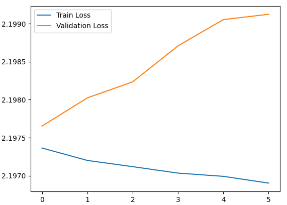
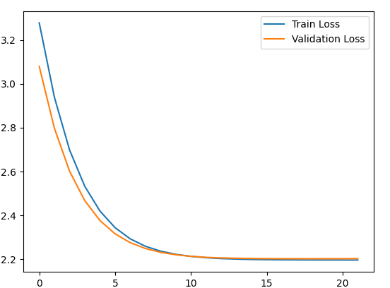
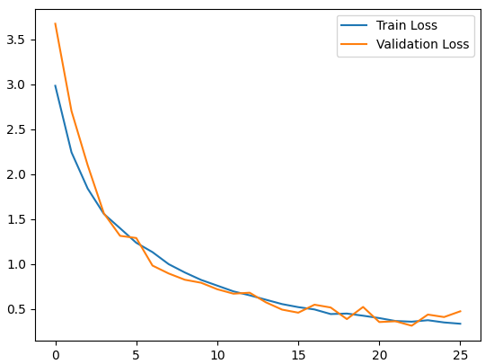

# A Beta version of A CNN Model for music genre recognition

### At this moment my model recognise 2 music genres: rock and hiphop.
<br>In the beginning I used a dataset downloaded from `https://www.kaggle.com/datasets/andradaolteanu/gtzan-dataset-music-genre-classification` and the following diagrams are based on it.

## First stage
### My first model was the following one:
```python
model = tf.keras.Sequential([
        tf.keras.layers.Dense(128, input_shape=(x_train.shape[1],), activation='relu'),
        tf.keras.layers.Dropout(0.5),
        tf.keras.layers.Dense(64, activation='relu'),
        tf.keras.layers.Dense(len(genres), activation='softmax')
    ])
```
and this diagram indicates that my model is likely overfitting. Here's how we can interpret the graph:

#### Train Loss Curve:
Continuously decreases, meaning the model is learning well from the training data. There are no large fluctuations, suggesting that it's not encountering convergence problems.

#### Validation Loss Curve:
Increases after the first epoch, indicating that the model is starting to memorize the training data (instead of learning useful generalizations for the validation set).


### My second model (and the final one) is :
```python
model = tf.keras.Sequential([
        tf.keras.layers.Dense(128, input_shape=(x_train.shape[1],), activation='relu', kernel_regularizer=tensorflow.keras.regularizers.l2(0.01)),
        tf.keras.layers.BatchNormalization(),
        tf.keras.layers.Dropout(0.5),

        tf.keras.layers.Dense(64, activation='relu', kernel_regularizer=tensorflow.keras.regularizers.l2(0.01)),
        tf.keras.layers.BatchNormalization(),
        tf.keras.layers.Dropout(0.3),

        tf.keras.layers.Dense(32, activation='relu', kernel_regularizer=tensorflow.keras.regularizers.l2(0.01)),
        tf.keras.layers.Dropout(0.3),

        tf.keras.layers.Dense(len(genres), activation='softmax')
    ])
```
#### And for this one we have this diagram:


#### Loss Reduction:
Both the training set loss (Train Loss) and the validation set loss (Validation Loss) decrease steadily until they reach a nearly stable point (around epoch 20).
This indicates that the model is learning well and there is no obvious overfitting, as the Train Loss and Validation Loss lines are close together.
#### Final Loss Value:
The losses for training and validation converge to a similar value (approximately 2.2). This is a good sign, as it indicates that the model generalizes well and the performance on the validation set does not suffer from major problems.
#### Curve Stabilization:
After about 15-20 epochs, the losses no longer decrease significantly. This suggests that the model has reached an optimal point in the learning process, and continuing training would not bring significant improvements.

## Second Stage

After testing it on my own, I observed that the results are not precisely as I expected. 
<br>So at this point I made the decision to change my dataset, and make it by my own. I made a script for downloading playlists from YouTube and after download I preprocessed each song by cutting in 30 seconds pieces. Now my dataset have about 1300 audio files per genre. With this dataset I trained again my model, now having this diagram:
<br>

## Theory
`MFCCs` are a feature representation that captures the spectral envelope of the audio signal, making it useful for various audio analysis tasks.