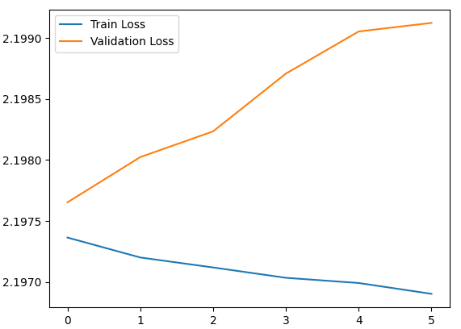
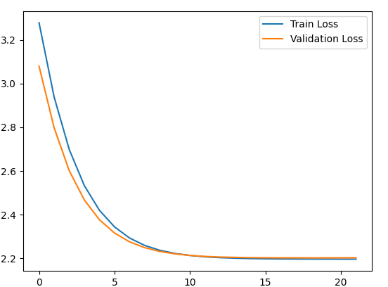

## Theory
`MFCCs` are a feature representation that captures the spectral envelope of the audio signal, making it useful for various audio analysis tasks.
```python
model = tf.keras.Sequential([
        tf.keras.layers.Dense(128, input_shape=(x_train.shape[1],), activation='relu'),
        tf.keras.layers.Dropout(0.5),
        tf.keras.layers.Dense(64, activation='relu'),
        tf.keras.layers.Dense(len(genres), activation='softmax')
    ])
```

```python
model = tf.keras.Sequential([
        tf.keras.layers.Dense(128, input_shape=(x_train.shape[1],), activation='relu', kernel_regularizer=tensorflow.keras.regularizers.l2(0.01)),
        tf.keras.layers.BatchNormalization(),
        tf.keras.layers.Dropout(0.5),

        tf.keras.layers.Dense(64, activation='relu', kernel_regularizer=tensorflow.keras.regularizers.l2(0.01)),
        tf.keras.layers.BatchNormalization(),
        tf.keras.layers.Dropout(0.3),

        tf.keras.layers.Dense(32, activation='relu', kernel_regularizer=tensorflow.keras.regularizers.l2(0.01)),
        tf.keras.layers.Dropout(0.3),

        tf.keras.layers.Dense(len(genres), activation='softmax')
    ])
```
